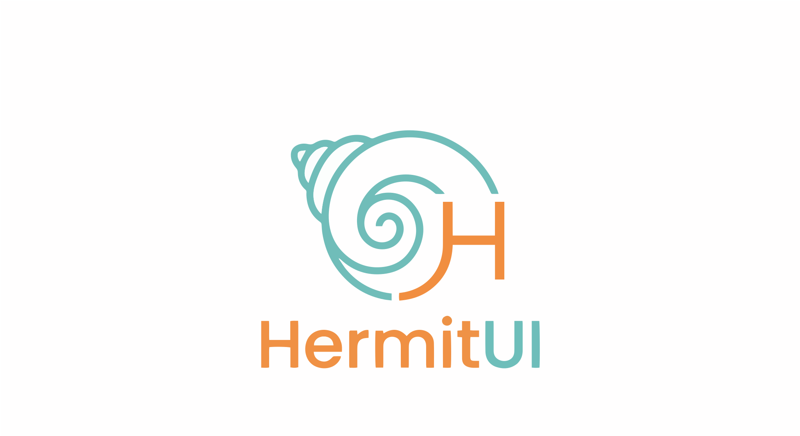
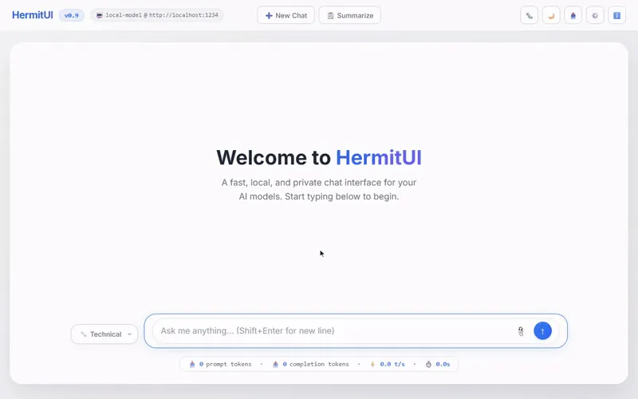

<div align="center">
  
  <p><i>A lightweight, modern, and ephemeral single-page web interface for local AI models.</i></p>
  <p>
    <a href="LICENSE"></a>
    
    
  </p>
  <p>
    <a href="https://moooff.github.io/HermitUI"><b>🌐 Online Demo</b></a> •
    <a href="#-try-it-in-60-seconds">Try it</a> •
    <a href="#-in-browser-inference">In-Browser AI</a> •
    <a href="#-benchmarks">Benchmarks</a> •
    <a href="#-connect-to-your-own-endpoint">Connect a server</a> •
    <a href="#-features">Features</a>
  </p>
</div>

<div align="center">
  
  <p><i>In-browser inference with WebGPU acceleration: the model downloads straight into memory (timelapsed) and the answer streams in real time.</i></p>
</div>

<div align="center">
  <a href="https://moooff.github.io/HermitUI">
    
  </a>
  <a href="https://moooff.github.io/HermitUI/dist/hermit-ui-wllama.html#gguf=hf:unsloth/Qwen3-0.6B-GGUF/Qwen3-0.6B-Q4_K_M.gguf">
    
  </a>
  <p><i>Left: connect it to your local AI server. Right: one click downloads a small but capable model (Qwen3-0.6B, ~380 MB) and chats <b>fully inside your browser</b> — no server at all.</i></p>
</div>

HermitUI is a chat interface that is **one `.html` file**. No install, no server, no build step, no npm — double-click it and it opens.

Two things set it apart, and the combination is the point:

*   **🧠 It runs models itself.** GGUF models execute entirely in your browser via llama.cpp compiled to WebAssembly, with WebGPU acceleration. A 12.1 GB model loads in a tab and decodes at 43 tok/s — [and we measured it properly](#-benchmarks).
*   **🔒 It stores absolutely nothing.** No `localStorage`, no `IndexedDB`, no cookies, no model cache, no telemetry. Close the tab and the conversation *and* the model are gone — [and you can check that in a minute](#verify-the-privacy-claim).

Or ignore all of that and point it at LM Studio, Ollama, llama.cpp, or vLLM as a [normal client](#-connect-to-your-own-endpoint).

Built for the machines where nothing else fits: air-gapped boxes, locked-down corporate and government networks, shared kiosks and hot desks.

## ⚡ Try it in 60 seconds

**One click:** open the [🧠 In-Browser AI Demo](https://moooff.github.io/HermitUI/dist/hermit-ui-wllama.html#gguf=hf:unsloth/Qwen3-0.6B-GGUF/Qwen3-0.6B-Q4_K_M.gguf) — it pre-fills Qwen3-0.6B (~380 MB) via the `#gguf=` hash parameter; confirm the banner and chat.

Or do it by hand:

1. Save [`dist/hermit-ui-wllama.html`](https://raw.githubusercontent.com/moooff/HermitUI/main/dist/hermit-ui-wllama.html) to disk (right-click → *Save link as…*, since GitHub serves raw `.html` as plain text), then open it in your browser.
2. Settings → Backend Mode → **True Offline (Wllama GGUF)**, then paste into the URL field: `hf:unsloth/Qwen3-0.6B-GGUF/Qwen3-0.6B-Q4_K_M.gguf`
3. Hit **⬇️ Load** (~380 MB download) and chat — no server, no install, and nothing persisted.

## 🧠 In-browser inference

HermitUI can run **true offline inference entirely in the browser** — no local server or OpenAI-compatible endpoint required. It's powered by [wllama](https://github.com/ngxson/wllama) (llama.cpp compiled to WebAssembly, with optional WebGPU acceleration): you load a `.gguf` model file and chat with it directly on the page.

This ships as a dedicated build output, **`dist/hermit-ui-wllama.html`** — the regular standalone app plus a **Backend Mode** switch in Settings (`Remote / Local API` ↔ `True Offline (Wllama GGUF)`). The main builds stay lean: the feature is stripped out of them at build time.

*   **🔌 The app needs no network:** The wllama engine (JS + WASM) is embedded directly into the file at build time (gzipped, decompressed in-browser via the native `DecompressionStream` API), so the ~6 MB file is complete on its own — perfect for USB-stick distribution to air-gapped machines. Pair it with a `.gguf` from disk and the whole stack is offline; only the *optional* download-by-URL path touches the network.
*   **📂 Local GGUF loading:** Pick a `.gguf` file from disk and run it fully client-side, with an optional **WebGPU** toggle for hardware acceleration. **Download a model once, keep it, and re-pick it every session** — no network involved, so this is also the fastest way to use HermitUI repeatedly (and the only way on an air-gapped machine).
*   **🔗 Load by URL / Hugging Face:** Paste a direct `.gguf` link, a Hugging Face `/blob/` page URL (auto-rewritten to `/resolve/`), or the `hf:user/repo/file.gguf` shorthand, then hit **Load**. The model streams **straight into memory** with a live progress bar — true to the ephemerality promise, nothing is written to browser storage. A URL-loaded model is therefore fetched again next session — unless you hit **💾 Save a copy to disk** under the URL field, which hands the same file to your browser's download flow so the file picker can load it [from then on](#download-once-reuse-offline). A model can also be baked into a shareable link: `hermit-ui-wllama.html#gguf=hf:user/repo/file.gguf` (see [Configuration via URL](#-configuration-via-url)).
*   **🎚️ Configurable inference:** Adjustable **context window** (`n_ctx`, default 32k — automatically halved until it fits in memory, with the effective size shown in the status line) and **max output tokens** per reply (default 4096); temperature, top-p, and seed from the regular settings apply too.
*   **🧩 Layered chat-template handling:** Uses the model's own embedded `tokenizer.chat_template` when present, otherwise auto-detects a sane format from the model architecture (ChatML, Llama 3, Mistral, Gemma, Phi-3, Zephyr, Alpaca, …), with a manual override.
*   **🐛 Quake-style debug console:** A drop-down console with graduated **verbosity levels** (Off → Errors → Warnings → Info → Debug) that surfaces engine init, download/load progress, model metadata, the exact prompt sent, and native llama.cpp logs.
*   **⏱️ Live tokens/s:** A real-time generation-speed readout while the model streams.

### 🚀 One-click model links

Every link below opens the wllama build with that model pre-filled via `#gguf=` — confirm the banner and it streams straight into memory. **Nothing is written to browser storage**, so a link-loaded model is fetched again next session unless you [keep a copy of the `.gguf`](#download-once-reuse-offline). Start small; the bigger rungs need a modern Chrome/Edge (see [Browser support](#browser-support--model-size-limits)).

| Model | Download | Try it |
|---|---|---|
| **Qwen3-0.6B** | 0.4 GB | [▶ Run in browser](https://moooff.github.io/HermitUI/dist/hermit-ui-wllama.html#gguf=hf:unsloth/Qwen3-0.6B-GGUF/Qwen3-0.6B-Q4_K_M.gguf) |
| **Qwen3-1.7B** | 1.1 GB | [▶ Run in browser](https://moooff.github.io/HermitUI/dist/hermit-ui-wllama.html#gguf=hf:unsloth/Qwen3-1.7B-GGUF/Qwen3-1.7B-Q4_K_M.gguf) |
| **Qwen3-4B** ⭐ | 2.5 GB | [▶ Run in browser](https://moooff.github.io/HermitUI/dist/hermit-ui-wllama.html#gguf=hf:unsloth/Qwen3-4B-GGUF/Qwen3-4B-Q4_K_M.gguf) |
| **Qwen3-8B** | 5.0 GB | [▶ Run in browser](https://moooff.github.io/HermitUI/dist/hermit-ui-wllama.html#gguf=hf:unsloth/Qwen3-8B-GGUF/Qwen3-8B-Q4_K_M.gguf) |
| **Gemma-4-E2B** | 3.1 GB | [▶ Run in browser](https://moooff.github.io/HermitUI/dist/hermit-ui-wllama.html#gguf=hf:unsloth/gemma-4-E2B-it-GGUF/gemma-4-E2B-it-Q4_K_M.gguf) |
| **Gemma-4-E4B** | 5.0 GB | [▶ Run in browser](https://moooff.github.io/HermitUI/dist/hermit-ui-wllama.html#gguf=hf:unsloth/gemma-4-E4B-it-GGUF/gemma-4-E4B-it-Q4_K_M.gguf) |
| **Gemma-4-12B** | 7.1 GB | [▶ Run in browser](https://moooff.github.io/HermitUI/dist/hermit-ui-wllama.html#gguf=hf:unsloth/gemma-4-12b-it-GGUF/gemma-4-12b-it-Q4_K_M.gguf) |
| **gpt-oss-20b** ⚠️ | 12.1 GB | [▶ Run in browser](https://moooff.github.io/HermitUI/dist/hermit-ui-wllama.html#gguf=hf:ggml-org/gpt-oss-20b-GGUF/gpt-oss-20b-MXFP4.gguf) |

⭐ = best speed/quality trade-off on a WebGPU machine. ⚠️ = the fastest model above 7 GB measured here (~43 t/s), but a 12 GB download that needs Chrome/Edge and a mostly-free GPU — see the note under the results table. Quants are `Q4_K_M` from [unsloth](https://huggingface.co/unsloth) except gpt-oss-20b, which is MXFP4 from [ggml-org](https://huggingface.co/ggml-org). On a CPU-only machine, use **Qwen3-1.7B** or smaller.

### Download once, reuse offline

**You only pay for the transfer once.** The links above re-fetch the model each session, which is fine for a first try but wasteful afterwards. Keep the `.gguf` on disk instead:

1. Put the model URL in **Settings → Backend Mode → True Offline**, then click **💾 Save a copy to disk** under the URL field. That downloads the same file through your browser's normal download flow, to a location you pick — the app itself still writes nothing.
2. Next session, load that file with the **file picker** in the same panel. No transfer, no network at all — and it's the only way to work on an air-gapped machine.

(Downloading the `.gguf` straight from Hugging Face works identically; the save link just points at the same file.)

Browsers don't allow a file path to be pre-filled from a link, so it stays a manual pick each session, and you still pay the model's load time — just not the download. The table below puts that at ≈6 s for Qwen3-0.6B up to ≈80 s for gpt-oss-20b, measured over a local HTTP server, so a disk pick is if anything quicker.

## 📊 Benchmarks

A [Playwright harness](benchmark/) drives the **unmodified** `dist/hermit-ui-wllama.html` — via `#gguf=` and the app's own buttons, exactly as a user would — and has every model answer the same [10 questions](benchmark/questions.json), scored for correctness by hand. 16 threads, RTX 5070 Ti, Edge (WebGPU), 3+ runs per model on a verified-idle GPU (the harness [refuses to start](benchmark/run_benchmark.py) otherwise).

| Model | Size | Load | avg TTFT | decode t/s | end-to-end t/s |
|---|---:|---:|---:|---:|---:|
| Qwen3-0.6B | 0.4 GB | 5.7s | 0.66s | **79** | 56 |
| Qwen3-1.7B | 1.1 GB | 11.3s | 0.91s | **73** | 54 |
| Qwen3-4B | 2.5 GB | 21.4s | 1.03s | **64** | 43 |
| Qwen3-8B | 5.0 GB | 41.5s | 1.17s | **55** | 35 |
| Gemma-4-E2B | 3.1 GB | 26.5s | 9.3s | 40 | 6.1 |
| Gemma-4-E4B | 5.0 GB | 36.6s | 11.7s | 32 | 5.6 |
| Gemma-4-12B | 7.1 GB | 58.6s | 15.2s | 36 | 4.0 |
| gpt-oss-20b † | 12.1 GB | ~80s | 3.4s | **43** | 15 |

*Load = engine init + model transfer from a local HTTP server (not your Hugging Face download time). Decode = pure generation speed with TTFT excluded; end-to-end = what the app's own stats readout shows, prompt processing included.*

† **gpt-oss-20b is MXFP4, not `Q4_K_M`, and it is a reasoning model.** Its hidden thinking trace inflates the end-to-end denominator — one terse-but-correct logic answer read 2.9 t/s end-to-end while decoding at 40.5 t/s — so that column is not comparable to the rest. Judge it on the decode column, which is excellent — and the answers are genuinely good. It is the strongest large rung here if you have the VRAM to spare.

CPU-only (WebGPU off, same machine): Qwen3-0.6B ≈ 16 t/s, Qwen3-1.7B ≈ 10 t/s. Everything larger is unusable — Qwen3-4B ≈ 3 t/s, Gemma-4-E2B ≈ 1.6 t/s.

**What the numbers say:**

*   **Qwen3 is the sweet spot in a browser.** Even 8B stays interactive on WebGPU, and TTFT is ~1 s across the whole family.
*   **Gemma-4 decodes fine but prompt-processes slowly under wllama** — 9–15 s before the first token drags the end-to-end figure into single digits even though tokens then arrive at 30–40 t/s. All its answers were correct: an engine-side prompt-eval gap, not a model-quality one.
*   **12.1 GB runs, and runs well.** gpt-oss-20b out-decodes the 7.1 GB Gemma-4-12B on a 16 GB card — a sparse MoE activating only ~3.6B params per token beats a dense model despite being 70% larger on disk. Architecture predicts throughput, not file size. WASM Memory64 (Chrome/Edge) is required: without it, anything above ~4 GB fails outright.
*   **The GPU matters more than the model.** 0.6B → 8B costs ~30% of decode throughput; dropping to CPU costs ~80%. Free VRAM matters most of all — a contended GPU understated these same runs by 23×, so if your numbers look nothing like these, check what else is on your card first.

**[Reproduce it yourself](benchmark/README.md)** — one `pip install`, no Node. Each run writes `review.md` with the timings *and every answer in full*, so quality is reviewable and not just asserted, plus a machine-readable `run.json`.

### Browser support & model size limits

How large a model you can load — and how fast it runs — depends on two WebAssembly/GPU features of your browser, which wllama detects at load time:

| Capability | What it enables | Chrome / Edge | Firefox | Safari |
|---|---|---|---|---|
| **JSPI** (`WebAssembly.Suspending`) | Streams the GGUF straight into the engine instead of copying it whole into the WASM heap → model size limited only by your RAM/VRAM | ✅ Chrome 137+ | ⚠️ **153+** only | ❌ none → ~3 GB cap |
| **WebGPU** (in workers) | Hardware-accelerated inference | ✅ mature | ⚠️ new / may fail to initialize → CPU fallback | ⚠️ present in recent versions, untested here |

HermitUI probes both at load time (by capability, not user-agent) and warns you in the panel before you start a download that can't succeed.

In practice:

*   **Chrome / Edge:** Multi-GB models (7B+ quants) load and run fine, with WebGPU acceleration. The limit is your actual RAM/VRAM.
*   **Firefox before 153:** Without JSPI, wllama falls back to copying the **entire model file into the 4 GiB WASM heap**. Models larger than roughly 3 GB fail with the cryptic error `source array is too long` (an unchecked allocation failure inside wllama). **Fix: update to Firefox 153+**, which enables JSPI by default. You can verify support by typing `!!WebAssembly.Suspending` into the DevTools console — it must print `true`.
*   **Firefox speed:** Even with JSPI, Firefox's WebGPU support is much newer than Chrome's and may not initialize inside the wllama worker, dropping inference to single-threaded CPU WASM — noticeably slower than Chrome on the same machine. Check the debug console (verbosity **Debug**, then reload the model) to see whether a WebGPU device or the CPU backend was picked. If WebGPU misbehaves, try unchecking the WebGPU toggle — a clean CPU run can beat a broken GPU path.
*   **Safari:** no JSPI at all, so the same ~3 GB ceiling applies with no version to upgrade to — Qwen3-0.6B and 1.7B are fine, Qwen3-4B is the realistic top rung, and anything larger fails. The benchmarks above were not run on Safari. The rest of HermitUI (the [normal client](#-connect-to-your-own-endpoint) mode) works everywhere.

## 🔌 Connect to your own endpoint

Prefer to run the model outside the browser? The standalone build (`index.html` / `dist/hermit-ui-standalone.html`) talks to anything that speaks the OpenAI chat completions API.

1.  **Start your local AI server** — [LM Studio](https://lmstudio.ai/), [Ollama](https://ollama.com/), [llama.cpp](https://github.com/ggml-org/llama.cpp), or [vLLM](https://github.com/vllm-project/vllm).
2.  **Open HermitUI** — double-click `index.html`; it opens in any modern browser.
3.  **Configure** — click **⚙️ Settings** in the top right to set the API URL, model name, API key, or system prompt.

<details>
<summary><b>Configuration examples for popular servers</b></summary>

### LM Studio (the default)
1. Launch LM Studio and start the **Local Server**.
2. **API URL:** `http://localhost:1234/v1/chat/completions`
3. **Model Name:** leave blank, or set to the specific model identifier you loaded.
4. *Tip:* ensure CORS is enabled in the LM Studio settings.

### Ollama
1. Start your Ollama server from the terminal, making sure to enable CORS:
   ```bash
   OLLAMA_ORIGINS="*" ollama serve
   ```
2. **API URL:** `http://localhost:11434/v1/chat/completions`
3. **Model Name:** the name of the model you pulled (e.g., `llama3`, `mistral`, `deepseek-coder`).

### vLLM
1. Start your vLLM server — it serves an OpenAI-compatible endpoint and already allows every origin by default:
   ```bash
   vllm serve meta-llama/Llama-3.1-8B-Instruct
   ```
   To pin the allowlist instead, pass `--allowed-origins` a JSON array: `--allowed-origins '["https://example.com"]'`.
2. **API URL:** `http://localhost:8000/v1/chat/completions`
3. **Model Name:** the model you served (e.g., `meta-llama/Llama-3.1-8B-Instruct`).

### Cloud models (OpenRouter, OpenAI, Groq, …)
1. **API URL:** the provider's chat completions endpoint (e.g., `https://openrouter.ai/api/v1/chat/completions`).
2. **Model Name:** the model you want (e.g., `anthropic/claude-opus-4.8`) — check your provider's model list for the exact slug.
3. **API Key:** enter your provider's key in the settings menu.

> [!WARNING]
> **Privacy note:** using cloud models is generally **not advised** if you require strict privacy. Your data leaves your machine, and it is unclear how these providers handle, store, or train on it. For true ephemerality, stick to local models.

</details>

### Troubleshooting (CORS)

If HermitUI fails to connect to your local AI server (e.g., a "Network Error"), it is most likely **CORS**. Because HermitUI runs as a local file (`file://`), browsers block its requests to `http://localhost` unless the server explicitly allows it.

*   **LM Studio:** "Local Server" tab → find the **CORS** toggle → turn it **ON**.
*   **Ollama:** set `OLLAMA_ORIGINS` before starting, e.g. `OLLAMA_ORIGINS="*" ollama serve`.
*   **vLLM:** allows all origins out of the box — if you narrowed it, widen `--allowed-origins` (it takes a JSON array, e.g. `'["*"]'`).

## ✨ Features

*   **📦 Zero-dependency setup:** all external libraries (Marked.js, DOMPurify, Highlight.js, KaTeX, Mermaid) and the Inter font are bundled directly into the file. No installation, no build step. (A CDN-linked developer version lives in `dist/hermit-ui-cdn.html`.)
*   **🔒 Privacy first & ephemeral:** no `localStorage`, `IndexedDB`, or cookies — nothing survives the tab.
*   **🧠 Thinking-model support:** built-in parser formats `<think>`, `<thought>`, and `<reasoning>` tags as they stream from reasoning models.
*   **⚡ Real-time streaming** with **📊 live performance stats** — prompt tokens, completion tokens, tokens/second, and total duration.
*   **🖼️ Image & vision support:** upload, drag-and-drop, or paste (Ctrl+V) images for vision-capable models, sent as `image_url` content per the OpenAI schema with automatic vision-model detection.
*   **📝 Rich rendering:** Markdown with per-block copy buttons, syntax highlighting, **🧮 LaTeX math** (`$…$`, `$$…$$`, `\(…\)`, `\[…\]`) rendered via KaTeX to native MathML — no webfonts, works mid-stream and offline — and **📈 Mermaid diagrams** from ```` ```mermaid ```` fences.
*   **🎭 Personas:** switch between preset system prompts (technical, general, writing, tutor) on the fly.
*   **✏️ Edit & regenerate** any previous message without restarting the conversation.

<details>
<summary><b>More features</b></summary>

*   **📎 Context attachments:** drag-and-drop or upload text files to inject their contents into your prompt.
*   **🎛️ Advanced sampling controls:** `temperature`, `max_tokens`, `top_p`, `presence_penalty`, `frequency_penalty`, and `seed` from a collapsible Settings panel. Params are only sent when set, keeping payloads compatible with minimal backends.
*   **🎨 Modern UI/UX:** clean, responsive design with smooth micro-animations, comprehensive CSS variables for theming, and a glassmorphism feel. Light and dark themes.
*   **💾 Chat export:** download the entire conversation as a formatted Markdown file.
*   **⚙️ Customizable settings:** API URL, model name, API key, and system prompt via the on-page settings overlay.

</details>

## 🔗 Configuration via URL

You can pre-configure HermitUI through the URL **fragment** (the part after `#`), so a single link or bookmark carries the whole connection setup:

```
hermit-ui-standalone.html#api=http://localhost:8080/v1&model=qwen3-8b
hermit-ui-standalone.html#api=https://api.groq.com/openai/v1&key=gsk_...&model=llama-3.3-70b
hermit-ui-wllama.html#gguf=hf:unsloth/Qwen3-0.6B-GGUF/Qwen3-0.6B-Q4_K_M.gguf
```

| Parameter | Effect |
|---|---|
| `api` | API base URL (same as the Settings field) |
| `model` | Model name |
| `key` | API key |
| `persona` | Preset persona: `technical`, `general`, `writing`, or `tutor` |
| `gguf` | *(wllama build only)* GGUF model to load in-browser — direct URL, Hugging Face link, or `hf:user/repo/file.gguf` shorthand. Shows a one-click confirmation banner before downloading. |

Why the fragment and not `?query`: the part after `#` **never leaves your browser** — it is not sent in any HTTP request — and nothing is stored, so this stays true to the ephemerality promise (the URL *is* the config; refresh keeps your setup). Applied settings are always announced in a toast, so a shared link can't reconfigure the app invisibly. Free-text system prompts are deliberately not supported as a parameter, since a link could smuggle a malicious prompt.

> [!NOTE]
> A `key` in the URL is never transmitted, but it does end up in your **browser history** (and any bookmark you save). Prefer entering keys in Settings on shared machines.

## 🎯 Ideal use cases

*   **Heavily regulated environments:** enterprise or government networks where software installation is restricted, but a secure local or remote inference endpoint is accessible.
*   **Air-gapped systems:** distribute on a USB stick and run on disconnected machines — either against a local network LLM server, or with the wllama build and a `.gguf`, against nothing at all.
*   **Ephemeral kiosks & shared terminals:** no chat history is ever written, making it safe for public workstations and desk-sharing environments.

## 🏗️ Architecture & philosophy

HermitUI enforces strict architectural constraints to remain lightweight and accessible:

*   **Single file constraint:** the final product is always a single, standalone `.html` file. The `src/` directory is a blueprint only — its split into `index.html`, `style.css`, and `script.js` exists for maintainability, and `build.py` assembles them back into one file.
*   **Vanilla only:** no React, Vue, Angular, or other frontend frameworks.
*   **No build tools:** no `package.json`, `npm`, Webpack, or Vite.
*   **No CSS frameworks:** pure vanilla CSS, no Tailwind or Bootstrap.
*   **Security:** all rendered AI responses are sanitized with `DOMPurify` to prevent XSS.

The live build runs on GitHub Pages at [moooff.github.io/HermitUI](https://moooff.github.io/HermitUI).

### Verify the privacy claim

"Stores nothing" is the whole pitch, so don't take it on trust — checking takes about a minute.

*   **At runtime:** open DevTools → **Application** → **Storage** and use the app normally. Local Storage, Session Storage, IndexedDB, Cookies and Cache Storage stay empty for the entire session, including after a model has loaded. This is the authoritative check: it covers the bundled libraries and the embedded wllama engine, not just HermitUI's own code.
*   **In the source:** grep the file you downloaded.
    ```bash
    grep -o "localStorage\|sessionStorage\|indexedDB\|document\.cookie" dist/hermit-ui-standalone.html | wc -l
    ```
    The answer is **2**, and both are false positives — Highlight.js's list of JavaScript keywords contains the strings `localStorage` and `sessionStorage`. There is not one call site. (In the wllama build the engine ships gzipped, so grep sees the app but not the engine; use the runtime check above to cover it.)
*   **On the network:** the Network tab shows requests only to endpoints you configured yourself — your API server, or the model URL if you chose to load a GGUF that way. No analytics, no phone-home, and no CDN at runtime in the standalone builds.

Model weights get the same treatment. A downloaded GGUF is streamed into an in-memory `Blob` instead of going through wllama's own URL loader, specifically because that one would persist the model to [OPFS](https://developer.mozilla.org/en-US/docs/Web/API/File_System_API/Origin_private_file_system) — see `downloadGgufToBlob` in [`src/script.js`](src/script.js).

## 📦 Building & development

The root `index.html` (a copy of `dist/hermit-ui-standalone.html`) is a completely offline, standalone build: web fonts and images are base64-encoded and external JS/CSS libraries are injected directly into the file, which is what makes it work in air-gapped environments.

To modify it, edit the modular sources in `src/` — `index.html`, `style.css`, and `script.js`, which reference libraries via CDN for convenient local development — then run:

```bash
python build.py        # or python3 build.py
```

**Prerequisites: Python 3 and, on the first run, an internet connection.** That is the whole list — `build.py` uses only the standard library, so there is no `pip install`, no `package.json`, and no Node.

The network requirement is worth spelling out, since it cuts against the rest of the project: the *output* runs offline, but *producing* it does not. On the first build, `build.py` downloads the pinned library versions (Marked.js, DOMPurify, Highlight.js, KaTeX, Mermaid, the Inter font, and the wllama engine — ~14 MB total) into `libs/`, verifying each one against the SRI hash pinned in `src/index.html`. Everything after that is cached and offline; pass `--refresh` to force a re-download. So if you need to build on an air-gapped machine, copy a populated `libs/` directory across with the repo.

This generates the standalone build at `dist/hermit-ui-standalone.html`, copies it to the root `index.html` for GitHub Pages, and creates the alternative builds in `dist/`. The standalone, CDN, and wllama variants (`dist/hermit-ui-standalone.html`, `dist/hermit-ui-cdn.html`, `dist/hermit-ui-wllama.html`) are committed so they are browsable and downloadable straight from GitHub; the local variant `dist/hermit-ui-local.html` and the downloaded `libs/` are generated-only and stay gitignored.

## 🤝 Contributing

Bug reports, questions and ideas are welcome in [Issues](https://github.com/moooff/HermitUI/issues); pull requests are welcome too. A bug report travels much further with your browser and version, whether WebGPU was on, and — for in-browser inference — the model and the output of the debug console at verbosity **Debug**.

Before opening a PR, two things will save you a rewrite:

*   **Read [`AGENTS.md`](AGENTS.md).** It is the single source of truth for this project's rules, and they are unusually strict on purpose: single-file output, vanilla JS only, no build tools or frameworks or CSS libraries, no `localStorage`/`IndexedDB`/cookies **for any reason**, and every AI-rendered string sanitized through `DOMPurify`. A change that breaks one of these can't be merged no matter how good it is — the constraints *are* the product.
*   **Edit `src/`, never the generated files.** `dist/*.html` and the root `index.html` are build artifacts and get overwritten; run `python build.py` and commit the regenerated outputs along with your source change.

There is no test suite or linter. Verify a change by opening the rebuilt `dist/hermit-ui-standalone.html` (or `dist/hermit-ui-wllama.html`) in a browser and exercising the affected path by hand. If your change touches inference performance, the [benchmark harness](benchmark/README.md) produces numbers that can go straight into a PR description.

## 🛠️ Built with

*   **Vanilla HTML5 / CSS3 / ES6 JavaScript**
*   [wllama](https://github.com/ngxson/wllama) — llama.cpp in WebAssembly, for in-browser inference
*   [Marked.js](https://marked.js.org/) — Markdown parsing
*   [DOMPurify](https://github.com/cure53/DOMPurify) — HTML sanitization / XSS prevention
*   [Highlight.js](https://highlightjs.org/) — code syntax highlighting
*   [KaTeX](https://katex.org/) — LaTeX math rendering (MathML output)
*   [Mermaid](https://mermaid.js.org/) — diagram rendering from ```` ```mermaid ```` fences
*   [Google Fonts (Inter)](https://fonts.google.com/specimen/Inter) — typography

## 🗺️ Roadmap

*   **Split-GGUF support:** load sharded models (`-00001-of-000NN.gguf`) through the in-browser URL loader.
*   **Save the in-flight download:** write the model to disk *as it downloads* (File System Access API), so keeping a copy costs one transfer instead of two. Chrome/Edge only, hence the simpler two-download link today.
*   **Companion text-analysis app:** a separate ultra-light single-file build (Transformers.js + WebGPU, sub-200 MB models) dedicated to summarization and text analysis.

The full list of ideas and tasks lives in [`docs/backlog.md`](docs/backlog.md).

## 📄 License

This project is open-source and available under the terms of the **GNU AGPL v3**. See the included [LICENSE](LICENSE) file for the full text.
