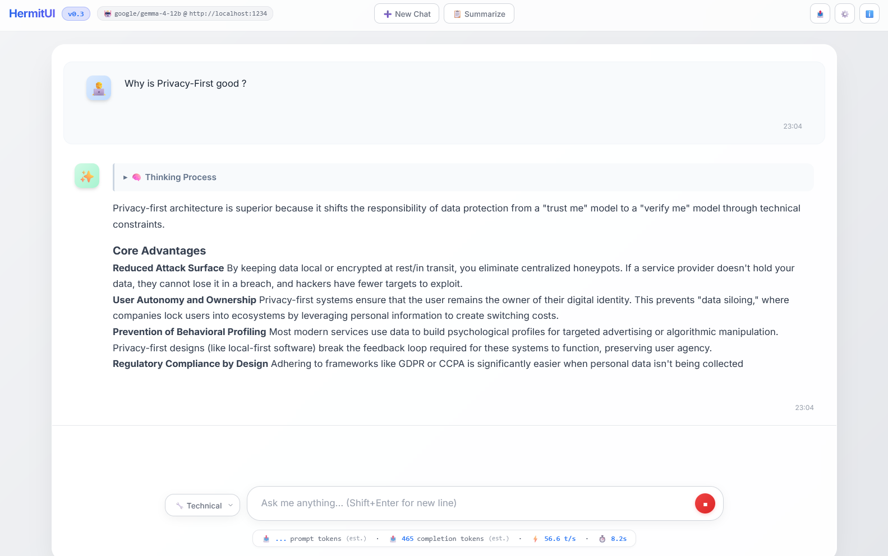

<div align="center">
  
  <p><i>A lightweight, modern, and ephemeral single-page web interface for local AI models.</i></p>
  <p>
    <a href="LICENSE"></a>
    
    
  </p>
  <p>
    <a href="https://moooff.github.io/HermitUI"><b>🌐 Online Demo</b></a> •
    <a href="#-ideal-use-cases">Use Cases</a> •
    <a href="#-features">Features</a> •
    <a href="#-quick-start">Quick Start</a> •
    <a href="#-troubleshooting-cors">Troubleshooting</a> •
    <a href="#-built-with">Built With</a> •
    <a href="#-architecture--philosophy">Architecture</a> •
    <a href="#-roadmap">Roadmap</a>
  </p>
</div>



<div align="center">
  <a href="https://moooff.github.io/HermitUI">
    
  </a>
  <p><i>Works entirely in your browser. Just connect it to your local AI server!</i></p>
</div>

HermitUI is a highly responsive web interface tailored for interacting with local AI models. It ships as **a single, self-contained `.html` file** built with nothing but vanilla HTML, CSS, and JavaScript. During development the source is split into `src/index.html`, `src/style.css`, and `src/script.js` for maintainability, and `build.py` assembles them into the standalone single-file deliverable.

No backend and no installation required—just open the file in your browser and start chatting!

## 🎯 Ideal Use Cases

*   **Heavily Regulated Environments:** Perfect for enterprise or government networks where software installation is restricted, but a secure local or remote inference endpoint is accessible.
*   **Air-Gapped Systems:** Can be easily distributed via USB and run on disconnected systems that only have access to a local network LLM server.
*   **Ephemeral Kiosks & Shared Terminals:** Ensures privacy by not saving any chat history, making it safe for public or shared workstations, especially in desk-sharing environments.

## ✨ Features

*   **📦 Zero-Dependency Setup:** The default `index.html` file has all external libraries (Marked.js, DOMPurify, Highlight.js) and the Inter font bundled directly into it. No installation or build steps required for the user. (A developer version using CDNs is available in `dist/hermit-ui-cdn.html`).
*   **🔒 Privacy First & Ephemeral:** By design, there is no local saving (`localStorage`, `IndexedDB`, or cookies) and no conversation history stored across sessions. Your data stays completely ephemeral.
*   **🧠 Thinking Model Support:** Built-in parser beautifully formats `<think>`, `<thought>`, and `<reasoning>` tags natively streamed by advanced reasoning models.
*   **🖼️ Image & Vision Support:** Upload, drag-and-drop, or paste (Ctrl+V) images straight into the input for vision-capable models. Attachments are sent as `image_url` content per the OpenAI schema, with automatic vision-model detection.
*   **🎭 Personas:** Switch between preset system prompts on the fly via a dropdown to instantly re-shape the assistant's behavior.
*   **📎 Context Attachments:** Drag-and-drop or upload text files to inject their contents directly into your prompt as context.
*   **✏️ Edit & Regenerate:** Edit any previous message or regenerate the assistant's last response without restarting the conversation.
*   **🎛️ Advanced Sampling Controls:** Tune `temperature`, `max_tokens`, `top_p`, `presence_penalty`, `frequency_penalty`, and `seed` from a collapsible panel in Settings. Params are only sent when set, keeping payloads compatible with minimal backends.
*   **🎨 Modern UI/UX:** Clean, responsive design with smooth micro-animations, comprehensive CSS variables for easy theming, syntax highlighting, and a premium glassmorphism feel.
*   **⚡ Real-Time Streaming:** Watch responses generate in real-time with an experience comparable to ChatGPT.
*   **📊 Live Performance Stats:** Built-in dashboard to monitor Prompt Tokens, Completion Tokens, Generation Speed (Tokens/Second), and Total Duration.
*   **📝 Markdown & Code Support:** Renders rich Markdown and provides one-click "Copy" buttons for code blocks.
*   **🧮 Math Rendering:** LaTeX math (`$…$`, `$$…$$`, `\(…\)`, `\[…\]`) is rendered via KaTeX to native browser MathML — no webfonts or extra CSS required, and it works mid-stream and fully offline. Currency amounts like "$5 and $10" are left alone.
*   **📈 Mermaid Diagrams:** ` ```mermaid ` code fences turn into rendered diagrams (flowcharts, sequence diagrams, pie charts, …) once a message finishes streaming. The Mermaid engine is embedded gzipped into the single-file builds and only decompressed the first time a diagram actually appears, so there is no cost for chats without diagrams.
*   **💾 Chat Export:** Easily download your entire conversation history as a formatted Markdown file for safekeeping.
*   **⚙️ Customizable Settings:** Quickly adjust the API URL, Model Name, API Key, and System Prompt via the on-page settings overlay.

## 🚀 Quick Start

1.  **Start your local AI server:**
    Ensure you have a local AI server running that provides an OpenAI-compatible API endpoint.
    *   *Examples:* [LM Studio](https://lmstudio.ai/), [Ollama](https://ollama.com/) (with OpenAI compatibility), or [vLLM](https://github.com/vllm-project/vllm).
    *   *Default expected endpoint:* `http://localhost:1234/v1/chat/completions` (LM Studio default).
2.  **Open HermitUI:**
    Simply double-click the `index.html` file to open it in any modern web browser.
3.  **Configure (if needed):**
    Click the **⚙️ Settings** button in the top right corner to update the API URL, the Model Name, or the default System Prompt to match your local setup.

## 💡 Setup Examples

Here are a few quick configuration examples based on popular local AI servers:

### Using LM Studio (Default)
1. Launch LM Studio and start the **Local Server**.
2. **API URL:** `http://localhost:1234/v1/chat/completions`
3. **Model Name:** Leave blank, or set to the specific model identifier you loaded.
4. *Tip:* Ensure CORS is enabled in the LM Studio settings.

### Using Ollama
1. Start your Ollama server from the terminal, making sure to enable CORS:
   ```bash
   OLLAMA_ORIGINS="*" ollama serve
   ```
2. **API URL:** `http://localhost:11434/v1/chat/completions`
3. **Model Name:** The name of the model you pulled (e.g., `llama3`, `mistral`, `deepseek-coder`).

### Using vLLM
1. Start your vLLM server with an OpenAI-compatible endpoint:
   ```bash
   python -m vllm.entrypoints.openai.api_server --model meta-llama/Llama-2-7b-chat-hf --cors-allowed-origins "*"
   ```
2. **API URL:** `http://localhost:8000/v1/chat/completions`
3. **Model Name:** The model name specified in your command (e.g., `meta-llama/Llama-2-7b-chat-hf`).

### Using Cloud Models (OpenRouter, OpenAI, Groq, etc.)
You are not limited to local models! HermitUI works perfectly with any cloud provider that offers an OpenAI-compatible API endpoint.

> [!WARNING]
> **Privacy Note:** While HermitUI supports cloud models, using them is generally **not advised** if you require strict privacy. When using third-party APIs, your data and chat history leave your local machine, and it is unclear how these providers handle, store, or train on that data. For maximum privacy and true ephemerality, stick to local models.

1. **API URL:** The provider's chat completions endpoint (e.g., `https://openrouter.ai/api/v1/chat/completions` or `https://api.openai.com/v1/chat/completions`).
2. **Model Name:** The specific model you want to use (e.g., `anthropic/claude-3.5-sonnet`, `gpt-4o`).
3. **API Key:** Enter your provider's API key in the settings menu.

## 🔗 Configuration via URL

You can pre-configure HermitUI through the URL **fragment** (the part after `#`), so a single link or bookmark carries the whole connection setup:

```
hermit-ui-standalone.html#api=http://localhost:8080/v1&model=qwen3-8b
hermit-ui-standalone.html#api=https://api.groq.com/openai/v1&key=gsk_...&model=llama-3.3-70b
hermit-ui-wllama.html#gguf=hf:Qwen/Qwen2.5-0.5B-Instruct-GGUF/qwen2.5-0.5b-instruct-q4_k_m.gguf
```

| Parameter | Effect |
|---|---|
| `api` | API base URL (same as the Settings field) |
| `model` | Model name |
| `key` | API key |
| `persona` | Preset persona: `technical`, `general`, `writing`, or `tutor` |
| `gguf` | *(wllama build only)* GGUF model to load in-browser — direct URL, Hugging Face link, or `hf:user/repo/file.gguf` shorthand. Shows a one-click confirmation banner before downloading. |

Why the fragment and not `?query`: the part after `#` **never leaves your browser** — it is not sent in any HTTP request — and nothing is stored, so this stays true to the ephemerality promise (the URL *is* the config; refresh keeps your setup). Applied settings are always announced in a toast, so a shared link can't reconfigure the app invisibly. Free-text system prompts are deliberately not supported as a parameter, since a link could smuggle a malicious prompt.

> [!NOTE]
> A `key` in the URL is never transmitted, but it does end up in your **browser history** (and any bookmark you save). Prefer entering keys in Settings on shared machines.

## 🔧 Troubleshooting (CORS)

If HermitUI fails to connect to your local AI server (e.g., getting a "Network Error"), it is most likely due to **CORS (Cross-Origin Resource Sharing)** restrictions. Because HermitUI runs as a local file (`file://`), modern browsers will block its requests to `http://localhost` unless the server explicitly allows it.

**How to fix it:**
*   **LM Studio:** Go to the "Local Server" tab, look for the "CORS" toggle, and make sure it is turned **ON**.
*   **Ollama:** You must set the `OLLAMA_ORIGINS` environment variable before starting Ollama. For example: `OLLAMA_ORIGINS="*" ollama serve`.
*   **vLLM:** Start your server with the `--cors-allowed-origins` flag. For example: `--cors-allowed-origins "*"`.

## 🏗️ Architecture & Philosophy

HermitUI enforces strict architectural constraints to remain lightweight and accessible:
*   **Single File Constraint:** The final product must always be a single, standalone `.html` file. The `src/` directory acts only as a blueprint; even if CSS or JS are refactored into separate files for development, the resulting output in the `dist/` directory and the root `index.html` will always remain fully integrated single files.
*   **Online Version:** You can try the live version hosted on GitHub Pages: [https://moooff.github.io/HermitUI](https://moooff.github.io/HermitUI)
*   **Vanilla Only:** No React, Vue, Angular, or complex frontend frameworks. 
*   **No Build Tools:** No `package.json`, `npm`, Webpack, or Vite.
*   **No CSS Frameworks:** Pure Vanilla CSS, no Tailwind or Bootstrap.
*   **Security:** All rendered AI responses are rigorously sanitized using `DOMPurify` to prevent XSS attacks.

## 📦 Building & Development

By default, the root `index.html` file (a copy of `dist/hermit-ui-standalone.html`) is a completely offline, standalone version. Web fonts and images are base64-encoded, while external JS/CSS libraries are injected directly into the file. It is perfect for air-gapped environments.

If you wish to modify the source code, edit the modular sources in `src/` — `index.html`, `style.css`, and `script.js` (which reference external libraries via CDN for convenient local development) — and then run the build script to regenerate the standalone root file:

```bash
python build.py
```

This generates the standalone build at `dist/hermit-ui-standalone.html`, copies it to the root `index.html` for GitHub Pages, and creates the alternative builds in the `dist/` directory. The standalone and CDN variants (`dist/hermit-ui-standalone.html`, `dist/hermit-ui-cdn.html`) are committed (browsable on GitHub); the local variant `dist/hermit-ui-local.html` and the downloaded `libs/` are generated-only and stay gitignored.

## 🛠️ Built With

*   **Vanilla HTML5 / CSS3 / ES6 JavaScript**
*   [Marked.js](https://marked.js.org/) - For parsing Markdown
*   [DOMPurify](https://github.com/cure53/DOMPurify) - For sanitizing HTML and preventing XSS
*   [Highlight.js](https://highlightjs.org/) - For code syntax highlighting
*   [KaTeX](https://katex.org/) - For LaTeX math rendering (MathML output)
*   [Mermaid](https://mermaid.js.org/) - For diagram rendering from ```` ```mermaid ```` fences
*   [Google Fonts (Inter)](https://fonts.google.com/specimen/Inter) - For clean, modern typography

## 🗺️ Roadmap

HermitUI is under active development. Here's what's in progress and on the horizon.

### 🧪 In-Browser Inference (wllama build)

HermitUI can run **true offline inference entirely in the browser** — no local server or OpenAI-compatible endpoint required. It's powered by [wllama](https://github.com/ngxson/wllama) (llama.cpp compiled to WebAssembly, with optional WebGPU acceleration): you load a `.gguf` model file and chat with it directly on the page.

This ships as a dedicated build output, **`dist/hermit-ui-wllama.html`** — the regular standalone app plus a **Backend Mode** switch in Settings (`Remote / Local API` ↔ `True Offline (Wllama GGUF)`). The main builds stay lean: the feature is stripped out of them at build time. Feature highlights:

*   **🔌 Truly zero-network:** The wllama engine (JS + WASM) is embedded directly into the file at build time (gzipped, decompressed in-browser via the native `DecompressionStream` API), so the ~5 MB file needs **no network access at all** — perfect for USB-stick distribution to air-gapped machines. The model file never leaves your machine.
*   **📂 Local GGUF loading:** Pick a `.gguf` file and run it fully client-side via WebAssembly, with an optional **WebGPU** toggle for hardware acceleration.
*   **🔗 Load by URL / Hugging Face:** Paste a direct `.gguf` link, a Hugging Face `/blob/` page URL (auto-rewritten to `/resolve/`), or the `hf:user/repo/file.gguf` shorthand and hit Load. The model streams **straight into memory** with a live progress bar — true to the ephemerality promise, nothing is written to browser storage, so it re-downloads each session. A model can also be baked into a shareable link: `hermit-ui-wllama.html#gguf=hf:user/repo/file.gguf` (see [Configuration via URL](#-configuration-via-url)).
*   **🎚️ Configurable inference:** Adjustable **context window** (`n_ctx`) and **max output tokens** per reply; temperature, top-p, and seed from the regular settings apply too.
*   **🧩 Layered chat-template handling:** Uses the model's own embedded `tokenizer.chat_template` when present, otherwise auto-detects a sane format from the model architecture (ChatML, Llama 3, Mistral, Gemma, Phi-3, Zephyr, Alpaca, …), with a manual override.
*   **🐛 Quake-style debug console:** A drop-down console with graduated **verbosity levels** (Off → Errors → Warnings → Info → Debug) that surfaces engine init, download/load progress, model metadata, the exact prompt sent, and native llama.cpp logs.
*   **⏱️ Live tokens/s:** A real-time generation-speed readout while the model streams.

#### Try it in 60 seconds

1. Open [`dist/hermit-ui-wllama.html`](dist/hermit-ui-wllama.html) in your browser (download the raw file first).
2. Settings → Backend Mode → **True Offline (Wllama GGUF)**, then paste into the URL field: `hf:Qwen/Qwen2.5-0.5B-Instruct-GGUF/qwen2.5-0.5b-instruct-q4_k_m.gguf`
3. Hit **⬇️ Load** (~400 MB download) and chat — no server, no install, and nothing persisted.

#### Browser support & model size limits

How large a model you can load — and how fast it runs — depends on two WebAssembly/GPU features of your browser, which wllama detects at load time:

| Capability | What it enables | Chrome / Edge | Firefox |
|---|---|---|---|
| **JSPI** (`WebAssembly.Suspending`) | Streams the GGUF straight into the engine instead of copying it whole into the WASM heap → model size limited only by your RAM/VRAM | ✅ Chrome 137+ | ✅ Firefox **153+** only |
| **WebGPU** (in workers) | Hardware-accelerated inference | ✅ mature | ⚠️ new / may fail to initialize → CPU fallback |

In practice:

*   **Chrome / Edge:** Multi-GB models (7B+ quants) load and run fine, with WebGPU acceleration. The limit is your actual RAM/VRAM.
*   **Firefox before 153:** Without JSPI, wllama falls back to copying the **entire model file into the 4 GiB WASM heap**. Models larger than roughly ~3 GB fail with the cryptic error `source array is too long` (an unchecked allocation failure inside wllama). **Fix: update to Firefox 153+**, which enables JSPI by default. You can verify support by typing `!!WebAssembly.Suspending` into the DevTools console — it must print `true`.
*   **Firefox speed:** Even with JSPI, Firefox's WebGPU support is much newer than Chrome's and may not initialize inside the wllama worker, dropping inference to single-threaded CPU WASM — noticeably slower than Chrome on the same machine. Check the debug console (verbosity **Debug**, then reload the model) to see whether a WebGPU device or the CPU backend was picked. If WebGPU misbehaves, try unchecking the WebGPU toggle — a clean CPU run can beat a broken GPU path.

### 🔭 Under Consideration

*   Split-GGUF (`-00001-of-000NN.gguf`) support for the URL loader.

## 📄 License

This project is open-source and available under the terms of the **GNU AGPL v3**. See the included [LICENSE](LICENSE) file for the full text.
